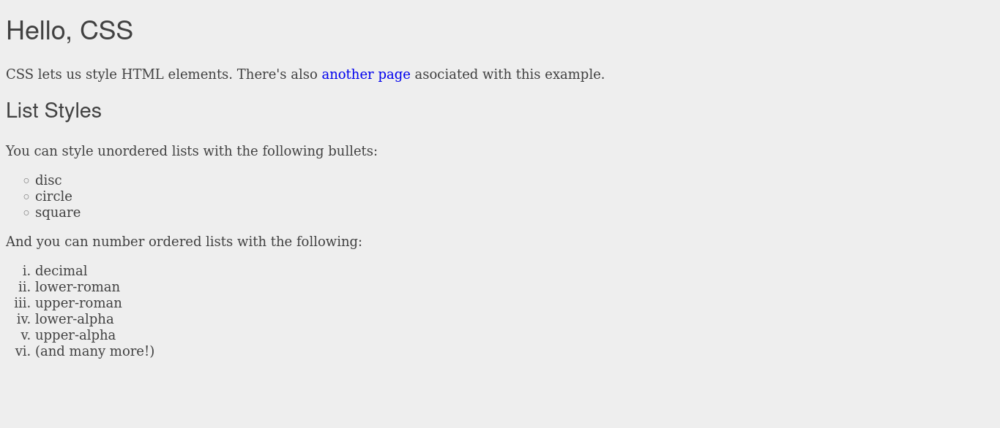
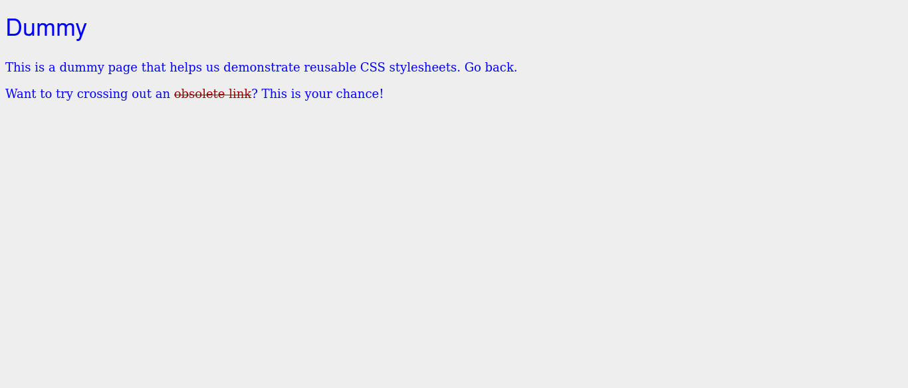

# Interneting Is Hard - Hello, CSS

This is a solution to the [Hello, CSS tutorial No. 4 of HTML & CSS Is Hard](https://www.internetingishard.com/html-and-css/hello-css/). 

## Table of contents

- [Overview](#overview)
  - [Screenshots](#screenshots)
  - [Links](#links)
- [My process](#my-process)
  - [Built with](#built-with)
  - [What I learned](#what-i-learned)
  - [Continued development](#continued-development)
  - [Useful resources](#useful-resources)
- [Author](#author)
- [Acknowledgments](#acknowledgments)

## Overview

### Screenshots




### Links

- Solution URL: [Hello, CSS solution](https://github.com/jugglingdev/hello-css)
- Live Site URL: [Hello, CSS live site](https://jugglingdev.github.io/hello-css/)

## My process

### Built with

- HTML5
- CSS

### What I learned

This tutorial was an introduction to CSS.  I learned how to style both internal and external CSS and its syntax using selectors, properties, and values.  It was fun to list multiple selectors, properties, or even values to keep the code clean or list fall backs for font.

In terms of units of measurement, I was familiar with `px` already, but a new one was `em`.  I like the idea of using relative measurements to save time in case you - or the user - ever want to change the base font size without worrying about the heading sizes.

Another neat thing to learn was all the options regarding styling bullets in lists.  I've included some code later in this section.

Other properties reviewed include `text-decoration`, `text-align`, `font-weight`, and `font-style`.

Probably my favorite thing to learn was how developers reuse CSS stylesheets linked to multiple pages to save time, space, and confusion.  It helps keep the site uniform, too.

Some code snippets I learned include:

```css
/* This is the syntax for CSS */
selector {
  property: value;
}
```

```css
/* List styles include disc, cirlce, and square */
ul {
  list-style-type: cirlce;
}
```

```css
/* Numbered list styles include decimal, lower-roman, upper-roman, lower-alpha, and upper-alpha */

ol {
  list-style-type: lower-roman;
}
```

```css
/* This is how to get rid of hyperlinks! */
a {
  text-decoration: none;
}
```

### Continued development

When linking a CSS stylesheet, I used `<link rel="stylesheet"...>`.  I peeked at a few other `rel` attribute options such as `alternate`, `archive`, `help`, `index`, and `license`.  It will be fun to get to use some of these in the future.

Another topic that I'd like to explore in the future is using the `list-style-image` property to create custom bullets for lists.  That would be so fun!

While this tutorial did a good job explaining the cascading nature of CSS, I'm curious about the application of page-specific styles beyond this tutorial.  

I'm also curious about using multiple stylesheets across a site.  I like the simplicity of one stylesheet, so diving into some more of these complexities will be interesting.

### Useful resources

- [MDN `list-style-image`](https://developer.mozilla.org/en-US/docs/Web/CSS/list-style-image) - Custom bullets for `<li>` elements!

- [MDN `<del>`](https://developer.mozilla.org/en-US/docs/Web/HTML/Element/del) - Demo of `<del>` and `<ins>` elements for semantic HTML to be styled with CSS `text-decoration: line-through`.

## Author

- GitHub - [@jugglingdev](https://github.com/jugglingdev)

- freeCodeCamp - [@jugglingdev](https://www.freecodecamp.org/jugglingdev)

- Frontend Mentor - [@jugglingdev](https://www.frontendmentor.io/profile/jugglingdev)

- LinkedIn - [Kayla Paden](https://www.linkedin.com/in/kayla-marie-paden)

## Acknowledgments

Shoutout to Oliver James for his dedication to publishing and maintaining InternetingIsHard.com.  His tutorials were the first that really clicked for me.